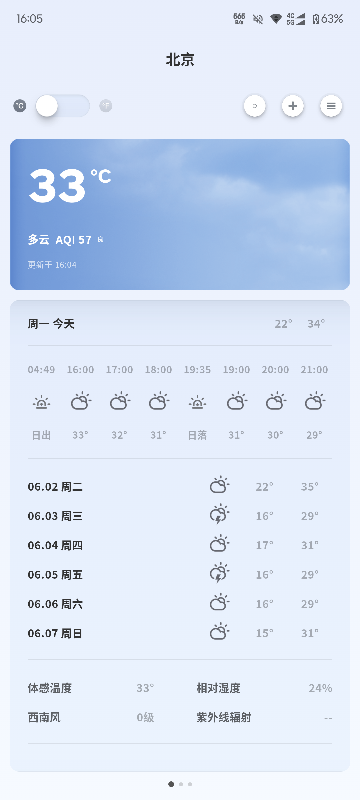

# 锤子天气 (Smartisan Weather)

基于 Jetpack Compose 重写的锤子天气客户端，复刻了原版锤子天气的界面风格与交互体验，并复用了 Smartisan 官方天气接口。

## 运行截图



## 功能特性

- 多城市天气：左右滑动切换不同城市，页面指示器标记当前位置
- 实时天气：当前温度、天气状况、空气质量（AQI）等关键信息展示
- 预报数据：未来多日预报与逐小时预报
- 城市管理：搜索、添加、删除与拖拽排序城市
- 摄氏 / 华氏切换：温标实时切换
- 拟物化温度数字：使用图片素材还原锤子风格的温度显示与切换动画
- 本地持久化：城市列表通过 SharedPreferences 保存
- 离线降级：接口不可用时自动回落到内置演示数据

## 技术栈

- Kotlin + Jetpack Compose（Material 3）
- MVVM 架构（`AndroidViewModel` + `StateFlow`）
- Navigation Compose 页面导航
- OkHttp + Kotlin Coroutines 网络请求
- 接口数据为 JSON，使用 `org.json` 解析

## 模块结构

```
app/src/main/java/com/ww/smartweather/
├── MainActivity.kt              // 应用入口
├── data/
│   ├── model/                   // 数据模型：City / Weather / Forecast / HourForecast
│   ├── api/
│   │   ├── WeatherApi.kt        // Smartisan 天气接口请求与签名
│   │   └── WeatherParser.kt     // 接口 JSON 解析
│   ├── WeatherCode.kt           // 天气代码到图标 / 文案的映射
│   └── DemoDataProvider.kt      // 离线演示数据
└── ui/
    ├── WeatherViewModel.kt      // 状态管理与业务逻辑
    ├── screen/                  // 页面：天气主页 / 城市列表 / 城市搜索
    ├── components/              // 自定义组件：温标切换 / AQI / 页面指示器 / 温度动画 / 图片温度
    └── theme/                   // 颜色 / 主题 / 字体
```

## 接口说明

天气数据来自 Smartisan 官方天气服务：

- 天气详情：`https://api-weather.smartisan.com/v3/info.php`
- 城市搜索：`http://api-weather.smartisan.com/v3/info/getCity`

请求参数通过 MD5 签名校验（见 `WeatherApi.kt`）。接口若请求失败或返回异常，应用会自动降级展示内置演示数据。

## 构建运行

```bash
./gradlew assembleDebug      # 构建 Debug APK
./gradlew installDebug       # 安装到已连接的设备
```

- minSdk 24，targetSdk / compileSdk 36
- Java 11

## 说明

本项目仅供学习与研究使用，天气数据版权归 Smartisan 所有。
